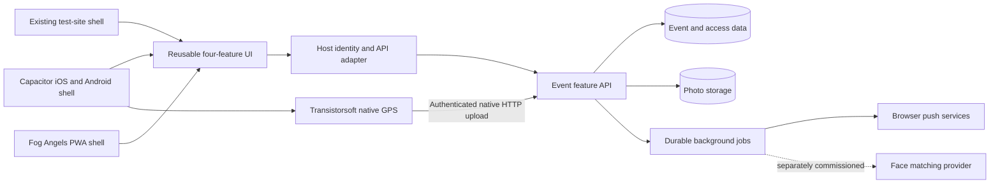

# Fog Angels PWA and native app integration execution plan

Status: planning only. No feature implementation, infrastructure provisioning or deployment is authorized by this planning document alone. This follows the delivered Tracker 1.2 baseline; it does not reopen the historical 1.2 implementation checklist.

## Outcome and commercial boundary

Windies Media Ltd. will develop four event features on the existing test site and incorporate them into Fog Angels Ltd.'s existing PWA:

1. Find Your Friend.
2. Find a Truck.
3. Push Notifications.
4. Photo Gallery, with optional AI face matching at an additional tenant cost.

The test site is `https://windies-truck-tracker.web.app/fog-angels`. The intended customer-facing destination is the existing `https://fogangels.com` application. Its current content, branding, shopping and registration journeys remain part of the host application.

Confirmed update: the user selected background tracking for both crew and patrons and wants a native app for friend sharing. Plan one Fog Angels app for iOS and Android, with role-based crew/patron screens, alongside the existing PWA. Use Capacitor to reuse the React interface and Transistorsoft Background Geolocation for the native location layer. The browser remains limited to foreground location sharing. See the [Transistorsoft implementation guide](../../docs/transistorsoft-integration-guide.md).

The existing package agreement is TT$15,000 with TT$7,500 down, TT$4,500 upon completed-app delivery and TT$3,000 on event day. Carnival hosting and event-day support are included; post-Carnival hosting is separate. AI implementation and usage are separately priced, with no AI credit allowance assumed. Native delivery is now in the requested technical scope: re-estimate the work and explicitly agree whether it fits the existing fee or changes the quotation. SDK licenses, developer accounts and ongoing native maintenance need a stated payer; no extra charge or purchase is automatically agreed. Dedicated tracking hardware, ticketing changes and unrelated integrations remain outside scope.

Quotation description should become: “Development and integration of four Carnival companion features across the Fog Angels PWA and iOS/Android app, including native background location sharing, testing, Carnival hosting and event-day technical support.” The completed-app milestone must specify acceptance of both the web integration and agreed native distribution deliverables. Store review introduces an external dependency; do not treat a standalone demo or a test build as the completed production delivery.

## Verified starting point

| Area | Evidence and implication |
| --- | --- |
| Existing test app | React/TypeScript/Vite frontend, Hono API, PostgreSQL on Supabase, Cloud Run and Firebase Hosting. Reuse these working components where compatible. |
| Truck tracking | Real crew-phone sharing, public map, start/end controls and freshness states already exist. The schema currently enforces one truck per band. Confirm truck count before promising a fleet selector. |
| Friends | No production friend-sharing implementation exists. “Show my location” currently remains on the device and is not friend sharing. |
| Push | Module placeholder only. The test site's service worker currently supports the offline shell, not push delivery. |
| Gallery / AI | Gallery is a curated brand-art preview. Production upload/storage, matching and AI credit accounting remain to be built. |
| FogAngels.com public inspection | On September 8, 2026, `/` and `/fantasy-island` served a JavaScript frontend. Its bundle contains React, Vite, Supabase and Lovable indicators. This suggests a compatible stack but does not establish repository ownership, actual auth usage or deployment access. |
| PWA configuration | No manifest link or active service-worker registration was observed on those two pages in a fresh Chromium visit. This does not rule out a PWA on another path or installation-specific behavior; verify source and actual installed app. |
| Existing commercial journeys | The site links to `registration2026.fogangels.com` and external event/ticket sites. These links do not establish shared login. Do not assume attendee accounts can be reused without verification. |
| Content | Some demo guide copy differs from current host event listings. Reconcile event dates, schedule, meeting references and contact details with Fog Angels before integration. |

Public inspection was read-only; no subscriptions, registrations, messages or customer-data writes were made.

## Recommended integration design

Build reusable feature screens and API operations behind a small host adapter for identity, navigation, branding, event configuration and permissions. The existing Truck Tracker shell hosts these modules during testing. The Fog Angels shell hosts the same modules in the finished integration.

Add a Capacitor native shell around the shared frontend. Bundle the interface into signed iOS/Android builds; production must not depend on loading an arbitrary remote website into a privileged WebView. Use platform adapters for browser geolocation versus Transistorsoft and Web Push versus native push. Share one server identity and permission model, with separate secure native sessions rather than assumed browser-cookie access.

Preferred delivery: source-level integration into the existing PWA, with lazy-loaded event routes and an API endpoint served through the Fog Angels origin where hosting permits. Keep the backend separately deployable. Confirm the host framework and routing before deciding whether the reusable frontend is a local package or copied source with a documented update process.

Proposed entry point: “On the Road” in the existing navigation. Candidate routes are `/on-the-road/truck`, `/on-the-road/friends`, `/on-the-road/photos` and `/on-the-road/updates`. These names are provisional until route collisions and the host's manifest scope are checked. Notification preferences belong in this area/account settings; AI matching belongs inside Photos.

This represents the reusable code design, not shared staging/production data. Each environment gets distinct data, storage, secrets, subscriptions and job queues.

If the source cannot accept feature modules but hosting permits same-origin routing, evaluate mounting the feature app under a reserved path with an explicit auth and service-worker integration contract. An external subdomain is a fallback with separate install, permission and login implications; it does not satisfy seamless integration automatically. An iframe is not the default solution. If neither source nor hosting control is available, retain the working test app and resolve access before committing to host integration.

## Phase 0 — Confirm the host and freeze the integration contract

- Locate the Fog Angels source repository or platform project and obtain appropriate development access. A repository, local folder or platform name has been requested; it remains an open dependency.
- Inspect the build, hosting, route rules, environments, manifest ID/start URL/scope, installed-app behavior, service-worker code and any existing push provider/subscriptions.
- Identify the actual login authority, if one exists. Verify roles and stable user IDs. Reuse that authority through server-verified tokens or a scoped session exchange; never treat a submitted email or browser-supplied role as identity proof. If there is no attendee login, choose and document one event-account flow.
- Confirm same-origin API proxy support. If direct cross-origin API calls are required, document allowed origins, token/session transport, CSRF protections and cookie behavior on real phones before feature construction.
- Confirm delivery date, exact event/support days and hours, expected concurrent users, truck count, uploader roles, photo volume, retention, hosting period and VAT wording. Record these as contract assumptions rather than inventing unlimited capacity.
- Preserve the existing PWA identity and subscription keys where applicable. Decide how existing users receive the update without breaking navigation, offline behavior or purchases.
- Confirm Apple/Google developer-account ownership, native app identifiers, SDK-license ownership and the store-release timeline. Existing PWA installs will not acquire native background tracking through a web update; patrons must install the native app and grant its permissions.

Exit: reviewed integration contract, access confirmed, one chosen identity model, route/API design and a documented acceptance checklist. Architecture-dependent implementation must wait for this outcome.

## Phase 1 — Visual design and isolated test foundation

- Preserve the approved Fog Angels look while adapting new screens to the existing PWA's typography, spacing and navigation. Prepare all four flows, organizer controls, permission prompts and empty/loading/error states for review.
- Use the existing test-site URL for client demonstrations. Before testing real friends, push or uploads, connect it to isolated staging API/data/storage and test-only notification recipients. The current deployed demo backend must not be assumed disposable.
- Keep app navigation and brand configuration outside feature logic. Add one host identity/API adapter rather than a second independent patron account system.
- Define event and tenant boundaries, user/crew/organizer permissions and feature switches on the server. Add forward-compatible migrations and backup/restore steps.
- After implementation is approved, prove the chosen route, identity and service-worker connection with a small integration check before investing in complete feature screens. Full feature acceptance still happens on the test site before integration rollout.

Exit: coherent designs, isolated test environment, verified integration path and working module boundaries.

## Phase 1A — Native background-tracking proof

Before building the full feature set, use a minimal Capacitor iPhone/Android test build with Transistorsoft and the isolated backend. Validate secure native authentication, permission onboarding, locked-screen movement, offline queue/replay, explicit stop, session expiry, logout and restart behavior. Use SDK-native HTTP upload so location delivery does not depend on an active React screen. Debug/trial evaluation comes before any license purchase.

The current endpoint timestamps fixes on receipt and the current public snapshot treats fixes older than 30 seconds as signal loss. Add a native ingestion contract that preserves capture time, deduplicates SDK location IDs and separates stationary state from connectivity. Never present a delayed offline upload as a new live fix. Test native expiry/stop behavior while JavaScript is suspended; document any required native hook before promising event-only background collection.

Exit: measured physical-device evidence, acceptable battery use, correct server privacy boundaries and no blocker to background friend sharing on either platform. The website alone cannot satisfy this gate. Implementation details and setup sequence are in the [SDK guide](../../docs/transistorsoft-integration-guide.md).

## Phase 2 — Find a Truck and Find Your Friend

### Find a Truck

- Reuse current tracking and improve crew start, pause/delay, recovery and end-of-event flows.
- Show last update, location accuracy and honest paused/stale states. Do not label an old pin as current. Do not replay queued old location writes as fresh after reconnection.
- Use Transistorsoft in the native app for background crew-phone sharing; retain the existing foreground web fallback. Configure explicit event sessions and tested lifecycle behavior. OS termination, force-stop, permissions, GPS availability and connectivity still constrain tracking; no unconditional continuous-tracking promise.
- If multiple trucks are agreed, replace the one-truck-per-band constraint with explicit truck IDs, assignment rules, selector and per-truck sharing sessions; regression-test old data during migration.

Acceptance: authorized crew movement appears on a second physical phone; denied permissions, offline periods and screen locking produce correct status; ending sharing removes the public position and rejects late writes.

### Find Your Friend

- Use signed-in users, expiring invitations or QR codes and explicit acceptance. Joining an event does not make a person's position visible to others.
- Let each person choose when to share, stop immediately, remove/block a connection and see exactly who can view them. Sharing expires at the agreed event/session boundary.
- Authorize every position read and write on the server against the current friendship and sharing session. Store the latest necessary position rather than a permanent route history by default.
- Keep private positions out of public APIs, service-worker caches, analytics and notification payloads. Clear displayed private positions on logout, revocation and expired freshness limits. Reject updates from revoked sharing sessions.
- Provide clear paused, last-updated, approximate-location and permission-denied states. Native patrons may opt into background sharing through Transistorsoft; browser patrons share only while the page is active. Viewing a friend's position works across both clients when authorized. Neither client promises navigation-grade accuracy or uninterrupted reporting under all OS/network conditions.

Acceptance: two invited users can find each other; an unrelated third account cannot; invitation reuse/expiry, blocking, sharing revocation, logout and offline recovery are tested, including server requests independent of the UI.

## Phase 3 — Push Notifications

- Deliver the same authorized announcement through separate transports: Web Push for the PWA, and APNs/FCM for native apps. Track device tokens/subscriptions by platform and environment, prevent duplicate event sends, handle token rotation and test native deep links. Transistorsoft does not provide this notification feature.
- Add contextual “Enable notifications” onboarding, support detection, iPhone installation guidance and preferences/unsubscribe controls. Ask browser permission only after an explicit user action.
- Extend the host's existing service-worker registration where one exists, preserving fetch/cache behavior. If no worker exists, add a coordinated one after reviewing install identity and scope. Avoid conflicting root workers.
- Store subscriptions by tenant/event, environment and device, with a user link where appropriate. Keep production keys stable; staging uses separate subscriptions and credentials.
- Provide authorized organizer compose, preview, test-send, audience confirmation and send history. Base scope is manual event announcements; automated truck-status alerts are a separately agreed enhancement, not one message per GPS update.
- Persist announcements in an in-app feed. Deliver push via durable jobs with bounded retries, duplicate suppression, expiration and removal of invalid subscriptions. A provider accepting a send is not proof a phone displayed it.
- Validate click destinations and open the intended Fog Angels route. Avoid stale event alerts being delivered after their usefulness expires.

Acceptance: a physical installed iPhone PWA and Android receive an authorized test announcement while the app is closed; tapping reaches the correct screen. Denial, unsubscribe, expired subscriptions, retries, existing-worker upgrade and no cross-environment sends are verified. General delivery remains subject to device permissions and connectivity.

## Phase 4 — Production Photo Gallery

- Default proposal: authorized photographers/organizers upload; attendees browse approved event images. Agree visibility, download rights and any attendee upload/moderation requirements before implementation.
- Select production object storage based on the confirmed infrastructure and agreed storage/egress budget. Existing R2 notes are a proposal, not evidence of a provisioned photo service.
- Use authorized, bounded uploads with server-side type/size verification and safe image processing. Generate thumbnails, remove location metadata from served images and handle iPhone photo formats explicitly.
- Provide upload progress, retry, duplicate handling, album/event filtering, full-image viewing and organizer publish/hide/delete controls. Paginate and load thumbnails before originals.
- Keep unapproved images private. Decide thumbnail/public versus private delivery rules explicitly; use short-lived access where needed. Enforce quotas and deletion/retention jobs in both metadata and object storage.

Acceptance: real phone images survive refresh and cross-device viewing; interrupted uploads recover; unauthorized uploads fail; moderation and deletion affect served results; agreed gallery volume remains usable on mobile data.

## Optional Phase 4A — AI face matching, separately commissioned

- Keep ordinary gallery access fully functional with AI disabled. Provide a clear optional entry point only when the tenant has purchased activation and usable credits.
- Validate providers using authorized sample photos that reflect costumes, face paint, night lighting and partial occlusion. Choose against match usefulness, false positives, retention/deletion capabilities and per-event processing cost; do not assume a provider or rate now.
- Use explicit consent for selfie-based self-search, an event-scoped index and results visible only to the requester. Do not offer public identity search or organizer identification of attendees. Present possible matches, with no guaranteed identification claim.
- Define selfie/template/index retention, consent withdrawal and deletion propagation before activation. Keep raw selfies and biometric templates out of logs and public storage.
- Meter both indexing and searching. Reserve budget atomically before a job, settle actual usage once, handle retries idempotently and stop new chargeable work at the tenant limit. Never silently exceed an approved allowance.

Exit: separate price/scope and usage terms accepted, provider selected, consent/deletion and no-credit behavior tested. If uncommissioned, this phase remains deferred and does not block the four-feature base delivery.

## Phase 5 — Test-site acceptance

Run the existing regression suite and new behavior tests for the implemented features. Record evidence rather than treating a polished screenshot as functional acceptance.

| Review | Required evidence |
| --- | --- |
| Visual | Small phones through desktop; bright outdoor readability, safe-area navigation, comfortable controls, no overlap, keyboard/focus and screen-reader labels, reduced motion and all failure states. |
| Device | Physical iPhone installed PWA and Android; supported browser versions recorded; permissions allowed/denied/revoked, app backgrounded, screen locked and battery-saving behavior. |
| Native SDK | Physical signed iOS/Android app builds; moving and stationary phones, screen lock, app dismissal versus OS force-stop, reboot, revoked permissions, offline replay, expired tokens and event-end collection/upload stop. |
| Functional | Friend invitation/revocation, truck start/end, notification send/click/unsubscribe and real gallery upload/moderation. Optional AI tested only if commissioned. |
| Privacy and authorization | Cross-user/event/tenant access denied; no private location caching; expired invitations and sharing sessions rejected; staff-only sends/uploads enforced. |
| Reliability | Poor signal, request timeouts, reconnection, stale GPS, interrupted uploads, push retries and job restarts. |
| Capacity | Load test the agreed concurrent users, GPS update rate, notification fan-out and photo volume. Define measurable latency/error targets during Phase 0; budget map tiles, database writes, storage and egress. |
| Operations | Feature switches, monitoring, backup/restore, failed-job visibility, retention jobs and event-day contact/escalation runbook. |

Exit: Fog Angels can complete each agreed user journey on the test site, visual review is accepted, and no unresolved critical defects remain.

## Phase 6 — Integrate into the existing PWA

- Work in a development branch/staging copy of the Fog Angels source. Bring in the accepted modules, connect the real identity adapter and add the agreed navigation entry and routes.
- Apply the final API routing, access rules and host styles. Reuse existing content where appropriate instead of copying stale demo event information.
- Integrate push handlers with the host worker and verify cache updates, offline routes, deep links and installed-app scope. An existing same-origin subscription should be retained where technically compatible.
- Users who opted in on the separate test domain must enroll on FogAngels.com; their permission grant is not a transferable production subscription. Verify this flow without asking every existing host subscriber to resubscribe unnecessarily.
- Regression-test home, costume browsing, registration/ticket links, forms, login/logout and existing PWA behavior. Test both a fresh installation and an existing installation updated in place.

Exit: all four features work inside the Fog Angels staging PWA, existing customer journeys pass, and integrated delivery is ready for acceptance.

## Phase 7 — Production release and Carnival operation

- Distribute native betas through TestFlight and an appropriate Google Play testing track; plan App Store/Google Play production distribution separately. Complete signing, permission explanations, store disclosures, review and install/deep-link checks before the event. Coordinate native/backend compatibility with web deployments; do not assume a web release updates installed native code.
- Record the accepted build, database migration and existing host rollback references. Use compatible schema changes and feature switches so a frontend rollback does not require destructive data reversal.
- Release first to staff/test accounts on the production origin. Confirm production notification permissions/click routes and physical-phone location behavior, then enable the accepted features for attendees.
- Publish concise install, notification and location-sharing guidance; hand over organizer and photographer workflows.
- Rehearse event-day crew assignments, charged devices/power banks, meet-up references and loss-of-signal fallback. Monitor API health, GPS age, push jobs, upload failures and storage/AI usage during agreed support hours.
- At the agreed Carnival end, expire friend sharing and truck sessions, stop event-only sends and apply retention rules. Continued hosting follows the separate post-Carnival arrangement.

Exit: production verification recorded, integrated app accepted, operational handover complete and support/hosting dates documented.

## Planning constraints and sources

- On iPhone/iPad, the supported push onboarding must account for Home Screen installation and permission requested through a user action. See [WebKit: Web Push for Web Apps on iOS and iPadOS](https://webkit.org/blog/13878/web-push-for-web-apps-on-ios-and-ipados/).
- Geolocation updates are tied to active, visible documents; continuous locked-screen sharing is not a PWA delivery promise. See [W3C Geolocation: request a position](https://w3c.github.io/geolocation/#request-a-position), currently an editor's draft; physical-device tests remain required.
- A document is controlled by one matching service worker, with the most specific scope winning; coordinate host worker changes. See [MDN: ServiceWorkerContainer.register](https://developer.mozilla.org/en-US/docs/Web/API/ServiceWorkerContainer/register).
- Push subscriptions are associated with a service-worker registration. See [MDN: PushManager.subscribe](https://developer.mozilla.org/en-US/docs/Web/API/PushManager/subscribe).
- Transistorsoft supports native iOS/Android clients through its [Capacitor SDK](https://github.com/transistorsoft/capacitor-background-geolocation). Native lifecycle behavior and upload constraints are covered in the linked SDK guide; these do not change browser geolocation limits.
- Existing route/content observations came from read-only inspection of [Fog Angels](https://fogangels.com/) and [Fantasy Island](https://fogangels.com/fantasy-island). Public bundle indicators are provisional until source review.

## Next decision

Review this plan before building. The crew-and-patron native-app decision is confirmed. The first implementation work, once approved, is host/account discovery followed by the minimal native tracking proof. No fixed completion date is promised until source access, account integration, native distribution, event capacity and optional AI scope are resolved. Proceed through acceptance gates in order; the AI add-on has an independent commercial gate.
